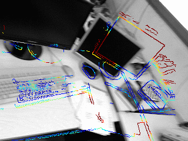

# Edge Alignment - CERES

Reimplementation of edge alignment [1] using CERES solver. Look at the folder `standalone`
for an easy to understand standalone implementation (abeit inefficient).

## Required Packages
- Eigen3
- CERES
- OpenCV
- ROS

[1] Kuse M., Shen S. “Robust Camera Motion Estimation using Direct Edge Alignment and Sub-gradient Method“. In Proc. of IEEE International Conference on Robotics and Automation (ICRA), 2016 in Stockholm, Sweden.

[2] CERES http://ceres-solver.org/

## Sample Alignment

## Note
This repo was an attempt for me to have a standalone
implementation of edge alignment. A basic standalone implementation
can be accessed in the folder `standalone`. It is not the most efficient implementation, but
it works. It uses Ceres's cubic_interpolation. Contributions welcome!

I believe, Yongyen [https://github.com/ygling2008/direct_edge_imu](https://github.com/ygling2008/direct_edge_imu) in his repo had
fixed it and is usable. You are better off trying to run his code.
The paper relating to yongyen's work is: 
[3] Yonggen Ling, Manohar Kuse, and Shaojie Shen, “Direct Edge Alignment-Based Visual-Inertial Fusion for Tracking of Aggressive Motions“, submitted in Springer Autonomous Robots. 

You may look at [https://kusemanohar.wordpress.com/2015/09/14/icra2015-submission/](https://kusemanohar.wordpress.com/2015/09/14/icra2015-submission/)
for more resources on this project.

If you are keen on using this, I suggest you implement the gradient decent yourself for this. Once you have a point cloud it is really not that hard. 
